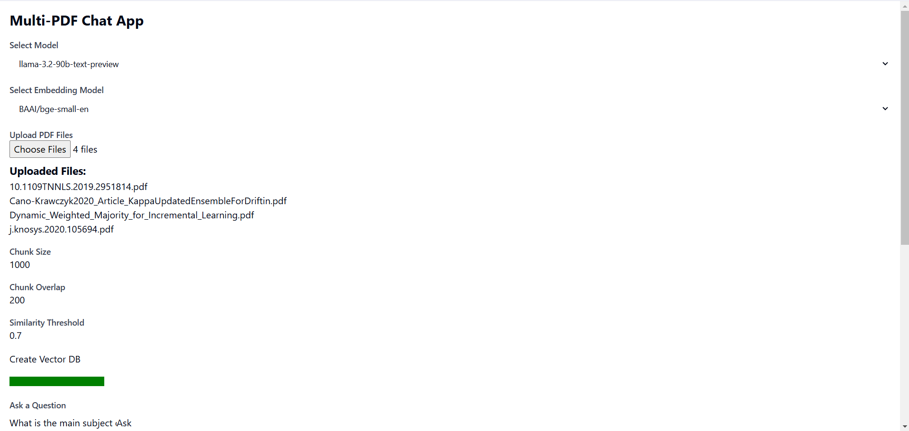
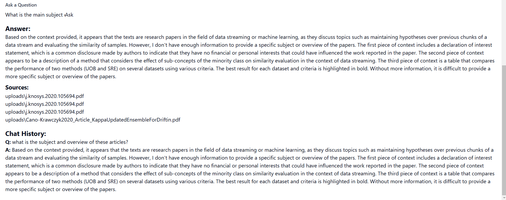

# Multi-PDF-s 📚ChatApp AI Agent 🤖

Meet MultiPDF Chat AI App! 🚀 Chat seamlessly with Multiple PDFs using Langchain, Google Gemini Pro &amp; FAISS Vector DB with FastAPI Backend and React Frontend. Get instant, Accurate responses from Awesome Google Gemini OpenSource language Model. 📚💬 Transform your PDF experience now! 🔥✨

## 📝 Description
The Multi-PDF's Chat Agent is a web application with a React frontend and FastAPI backend designed to facilitate interactive conversations with a chatbot. The app allows users to upload multiple PDF documents, extract text information from them, and train a chatbot using this extracted content. Users can then engage in real-time conversations with the chatbot.

## 📸 Screenshots

### Application UI


### Sample Answer


## 🎯 How It Works:
------------

The application follows these steps to provide responses to your questions:

1. **PDF Loading** : The app reads multiple PDF documents and extracts their text content.

2. **Text Chunking** : The extracted text is divided into smaller chunks that can be processed effectively.

3. **Language Model** : The application utilizes a language model to generate vector representations (embeddings) of the text chunks.

4. **Similarity Matching** : When you ask a question, the app compares it with the text chunks and identifies the most semantically similar ones.

5. **Response Generation** : The selected chunks are passed to the language model, which generates a response based on the relevant content of the PDFs.

--- 
## 🎯 Key Features

- **Adaptive Chunking**: Our Sliding Window Chunking technique dynamically adjusts window size and position for RAG, balancing fine-grained and coarse-grained data access based on data complexity and context.

- **Multi-Document Conversational QA**: Supports simple and multi-hop queries across multiple documents simultaneously, breaking the single-document limitation.

- **File Compatibility**: Supports both PDF and TXT file formats.

- **LLM Model Compatibility**: Supports Google Gemini Pro, OpenAI GPT 3, Anthropic Claude, Llama2 and other open-source LLMs.

## 🌟Requirements

### Frontend
- React
- @shadcn/ui
- TailwindCSS
- Axios
- TypeScript

### Backend
- FastAPI
- google-generativeai
- python-dotenv
- langchain
- PyPDF2
- faiss-cpu
- langchain_google_genai

---

## ▶️Installation

Clone the repository:

```bash
git clone https://github.com/BlakeAmory/multi_pdf_chatapp.git
cd multi_pdf_chatapp
```

### Backend Setup

1. Install Python dependencies:
```bash
pip install -r requirements.txt --upgrade
```

2. Create a `.env` file in the root directory and add your API keys:
```
GOOGLE_API_KEY ="your-google-api-key"

OPENROUTER_API_KEY ="your-openrouter-api-key"

GROQ_API_KEY ="your-groq-api-key"

GITHUB_TOKEN ="your-github-token"
AZURE_ENDPOINT=""https://models.inference.ai.azure.com""

HF_TOKEN="your-hugging-face-token"
```

3. Start the backend server:
```bash
cd backend
uvicorn app.main:app --reload
```

### Frontend Setup

1. Install Node.js dependencies:
```bash
npm install
```

2. Install required packages:
```bash
npm install react @types/react
npm install @shadcn/ui
npm install -D tailwindcss postcss autoprefixer
npx tailwindcss init -p
npx shadcn@latest init
npm install axios
```

3. Start the frontend development server:
```bash
npm run dev
```

---
## 💡Usage

To use the Multi-PDF-s 📚ChatApp AI Agent 🤖:

1. Ensure both backend and frontend servers are running
2. Upload PDF documents through the web interface
3. Ask questions about the uploaded documents using the chat interface
4. The application will provide responses based on the content of the uploaded documents using conversational AI

---
## ©️ License 🪪 

Distributed under the MIT License. See `LICENSE` for more information.

---

#### **If you like this LLM Project do drop ⭐ to this repo**

---
